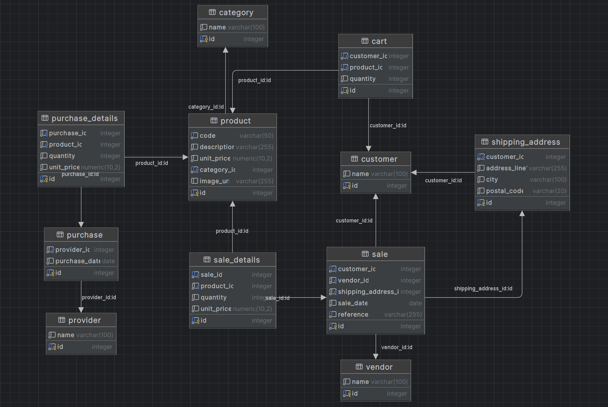

<h1 align="center">
   
   <div align="center">Some Store</div>
</h1>

<p align="center">
    <a href="https://github.com/Yrrrrrf/some_store">
        
    </a>
    
    
</p>

<p align="center">
Manage the operations of a <strong>generic store</strong> through a comprehensive database and a robust API.
</p>

The database consists of various tables and views that store critical information related to sales, products, customers, and inventory management.

- The API, built using [FastAPI](https://fastapi.tiangolo.com/), provides endpoints for interacting with this data, allowing for efficient data retrieval, manipulation, and reporting.
- The frontend application, built using [Svelte](https://svelte.dev/) provides a user-friendly interface for interacting with the API, allowing users to view & manipulate data in real-time.

## Setup

### Prerequisites

Install the [PostgreSQL](https://www.postgresql.org/download/) database server and used files inside the [sql](./sql) folder to create the database schema and populate it with sample data.

Use the latest version of [Python](https://www.python.org/downloads/).

Use [npm](https://www.npmjs.com/get-npm) to run the frontend application.

### Installation

Install the required packages using the following command:
```bash
# using pip
pip install -r requirements.txt  # using pip
# using conda or mamba
conda install --file requirements.txt  # using conda
mamba install --file requirements.txt  # using mamba
```

Install the `npm` package manager and the `svelte` framework to run the frontend application.
```bash
cd hub  # change to the frontend directory (svelte app)
npm install  # install the required packages
```

Create the [.env](./.env) file in the root directory and **add the following environment variables** to configure private database credentials:
```bash
# * Database (PostgreSQL)
DB_NAME = "some_store"  # the name of the database to connect to
DB_HOST = "localhost"  # the host of the database
DB_PORT = "5432"  # default port
DB_OWNER = "some_store_owner"  # the superuser (owner) of the database
DB_OWNER_PASSWORD = "store_password"  # the password of the superuser

# * Authentication (JWT)
SECRET_KEY = "some_secret_key"  # used to sign the JWT tokens
ALGORITHM = "HS256"  # algorithm used to sign the JWT tokens
ACCESS_TOKEN_TIME = 30
```

Execute the [00_create_db.sql](./sql/00_create_db.sql) file with a superuser to create the database to create the database.

Once created the database. Use the [setup.py](./src/setup.py) script to create the database schemas and populate it with sample data using the following command:
```bash
python src/setup.py
```

## Database Schema



## Running the Application

- Run the API server using the following command:
```bash
uvicorn src.main:app --reload --host 127.0.0.1 --port 8000
# or 
python src/main.py  # run the API server (this way doesn't support live reload)
```
- Look for the API documentation at [port/docs#/](http://127.0.0.1:8000/docs#/).

- Excecute the frontend application using the following command:
```bash
cd hub  # change to the frontend directory (svelte app)
npm run dev  # run the frontend application
```
- Access the frontend application at [port 5173](http://localhost:5173/)


## 📘 Documentation

For detailed information about the API endpoints and database schema, please refer to the [API Documentation](http://127.0.0.1:8000/docs) when the server is running.

## 🤝 Contributing

Contributions, issues, and feature requests are welcome! Feel free to check the [issues page](https://github.com/Yrrrrrf/some_store/issues).

## [License](./LICENSE)

This project is licensed under the terms of the MIT license.
